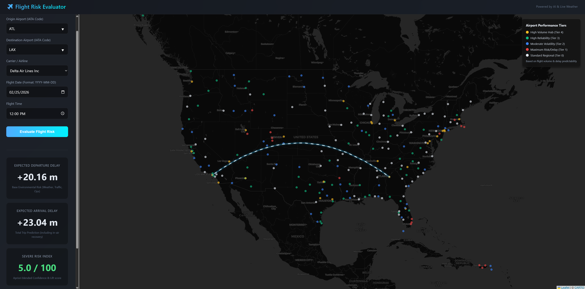

# ✈️ Flight Risk Evaluator

Welcome to the **Flight Risk Evaluator**! This project is an end-to-end Machine Learning web application designed to predict flight delays and model severe operational risks across major US airports. It integrates historical flight performance data with complex environmental risk factors to deliver actionable, real-time predictions.


_(Note: Ensure you include a screenshot of your dashboard named `dashboard.png` in the root of the repository)_

## 🌟 Key Features

- **Dynamic Risk Prediction**: Utilizes Scikit-Learn **Random Forest Regressors** to predict both Expected Departure Delay and Expected Arrival Delay, accounting for potential in-air recovery.
- **Severe Risk Indexing**: Calculates a blended Confidence and Lift score using **Apriori Association Rules**, evaluating localized weather patterns (snow, rain, wind), carrier performance, and time-block traffic to flag high-risk flights.
- **Interactive Airport Map**: Features an intuitive, interactive map built on **React-Leaflet** and CARTO dark tiles. Airports are color-coded into Performance Tiers based on **K-Means clustering analysis** of delay volatility and flight volume.
- **Sleek UI/UX**: Designed with a modern, dark-mode glassmorphism aesthetic using vanilla CSS, offering a premium and responsive user experience without heavy UI framework bloat.
- **Cloud-Optimized Architecture**: The Python backend dynamically fetches the heavy serialized `.joblib` machine learning models from a remote **Hugging Face Hub** repository at runtime, keeping this GitHub repository incredibly lightweight and easy to deploy.

## 🛠️ Technology Stack

- **Frontend Development**: React.js, Vite, React-Leaflet, PapaParse
- **UI/UX Design**: Vanilla CSS (CSS Grid/Flexbox, Custom Animations, Glassmorphism elements)
- **Backend API**: Python, FastAPI, Uvicorn
- **Data Engineering & ML**: Pandas, Scikit-Learn (Random Forest, K-Means PCA), Hugging Face `huggingface_hub`

## 🧠 Machine Learning Architecture

This project implements a sophisticated multi-stage ML pipeline:

1. **Unsupervised Learning (K-Means)**: Groups thousands of US airports into 5 distinct Performance Tiers (e.g., High Volume Hubs, Maximum Risk) based on their historical delay volatility and overall traffic volume.
2. **Association Rule Mining (Apriori)**: Extracts rules that strongly associate environmental conditions (e.g., wind > 15mph, snow > 0.5in) and temporal patterns with severe delays, generating actionable text-based warning conditions.
3. **Supervised Learning (Random Forest)**: Acts as the core predictive engine that provides the continuous expected delay output in minutes for both departure and arrival phases.

## 🚀 Quick Start Guide

### Prerequisites

- Node.js (v18+)
- Python 3.8+

### 1. API Setup (Backend)

The backend dynamically downloads the required Machine Learning models from a remote Hugging Face repository upon first startup.

```bash
# Navigate to the backend API folder
cd api

# Install Python dependencies
pip install -r requirements.txt

# Start the FastAPI Server
uvicorn main:app --reload
```

_The API will run on `http://localhost:8000`._

### 2. Client Setup (Frontend)

```bash
# Open a new terminal and navigate to the frontend client folder
cd client

# Install npm dependencies
npm install

# Start the React development server
npm run dev
```

_The application UI will run on `http://localhost:5173`._

---

_Note: The raw data analysis notebooks, extensive dataset filtering scripts, and clustering experiments used to train the original models are preserved in the `archive` directory for technical review._
